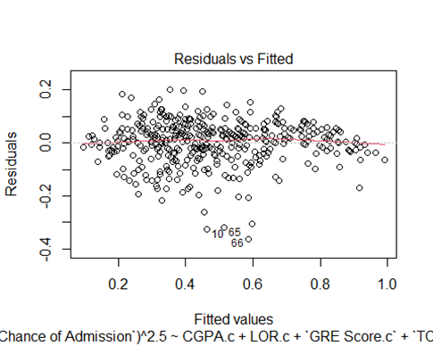
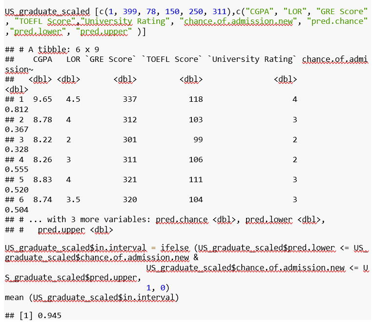
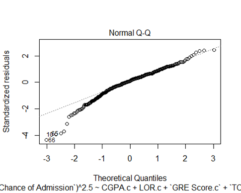
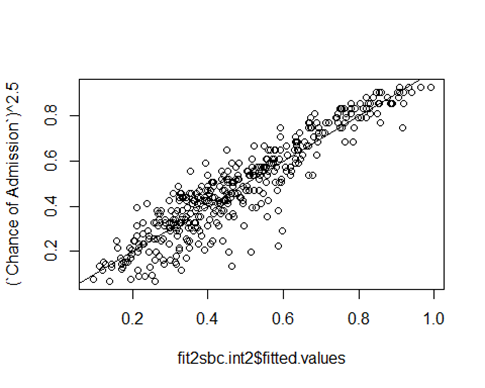
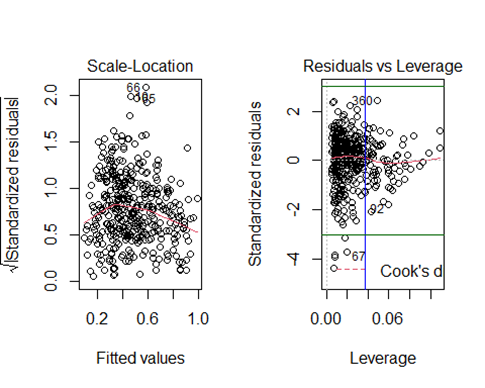
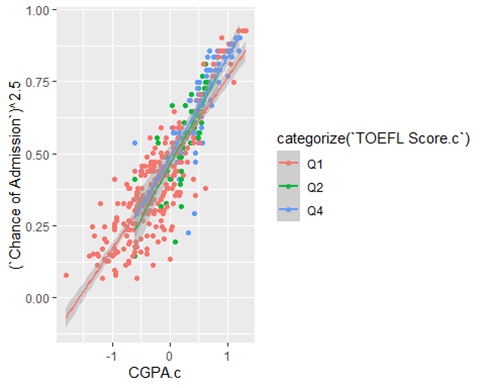
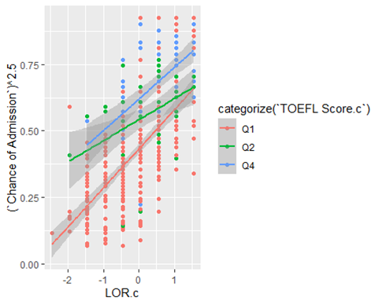

# Predicting Graduate School Acceptance Probability

 

Badge [source](https://shields.io/)

## Key findings

This model suggests that College GPA and Letters of Recommendation are the most significant predictors towards graduate school admission. The prediction interval we would expect from our final model is 94.5%. Thus, we would expect and accuracy of approximately 95%. 

## Authors

- [@siyamabu](https://www.github.com/siyamabu)

**Language and Tools:** 
* R 🏴‍☠️ 
* R Notebook Notebook :notebook:
* GitHub :heart_eyes:

**Libraries used:** 
* vvd
* mass
* ggplot2
* tidyr
* dplyr

**Environments Used:** 
* Windows 10 🪟

## Table of Contents

  - [Motivation](#motivation)
  - [Data source](#data-source)
  - [Methods](#methods)
  - [Quick Glance at the Results](#quick-glance-at-the-results)
  - [Lessons Learned and Recommendations](#lessons-learned-and-recommendations)
  - [Limitations and What Can Be Improved](#limitations-and-what-can-be-improved)
  - [Explore the Notebook](#explore-the-notebook)
  - [License](#license)

## Motivation 

When an undergraduate student finishes their studies, they often seek to look for job opportunities or/and further their education. For those who choose to continue their academic journey by going to graduate school, understanding graduate school requirements becomes important. These requirements vary depending on each school's requirements, however, on many occasions, there are few common factors such as College GPA that can play a role in contributing to one’s chance of being accepted. Upon finishing my junior year of college, I wanted to know which graduate school requirements have more significance and would increase my chances of being accepted if I opted to futher my education. 

## Data Source

- [Graduate Admissions](https://www.kaggle.com/mohansacharya/graduate-admissions)

## Dataset Description

This data  is related to graduate school adimission probability. The dataset contains several factors which are generally considered as important during an individual’s application to master’s programs. This factors include Graduate Record Examination (GRE) Scores; TOEFL Scores; Statement Of Purposes (SOP); Letter Of Recommendations (LOR); College GPA (CGPA); and University Ratings. 

## Methods

1. Exploratory Data Analysis
    * Historgrams of each quantitative predictor variable 
    * Scatterplot matrix
    * An assessment of pairwise correlations between pairs of quantitative predictor variable
2. First Order Model with All Predictors
    * Residual Analysis
    * Box-Cox analysis to see if the response variable should be transformed
3. Second Model with the transormed variable vs All Predictors
    * Residual Analyis
4. Third Model using Stepwise Regression
   * AIC stepwise regression
   * Interaction Analysis
5. Fourth Model using Stepwise Regression with Centered Interaction Effects
   * Residual and Influence Anaysis
   * Variance inflation factors analysis
   * Interaction Plots

## Quick Glance at the Results

The final model is: 

Predicted chance of admission^2.5  = 0.453 + 0.171 (CGPA) + 0.029 (LOR) + 0.003 (GRE SCORE) + 0.004 (TOEFL SCORE) + 0.015(University Rating) + 0.005 (CGPA)(TOEFL SCORE) - 0.002 (LOR)(TOEFL SCORE) + 0.004 (LOR)(UNIVERSITY RATING). 0.001(GRE SCORE)((UNIVERSITY RATING))

Residual Analysis of Final Model

Example Predictions from Final Model

All of the six example students whose predictions are shown above have prediction intervals that contain the observed chance of admission. Furthermore, the prediction interval we would expect from this model is 94.5%.

Normal Q-Q Plot of Final Model

Chance of Admission vs. Fitted Values

 

Standardized residuals vs. Leverage Plot

 

Interaction Plot of TOEFL Score and CGPA. 

Interaction Plot of TOEFL Score and LOR.

 

## Lessons Learned and Recommendations
- College GPA is the most significant predictor of graduate school acceptance probability
- Letters of Reccommendation is the second most significant predictor
- Given that some institutions have a minimum College GPA requirement for their Master's programs coupled with GPA's significance towards acceptance probability, it is important that one makes efforts towards maintaining a good undergraduate GPA if they wish to persue a Master's program
- Build good relationships with professors, supervisors, advisors, etc, so you can have a good letter of reccommendation and increase the likelihood that you are accepted into a Graduate Program

## Limitations and What Can Be Improved
- Each institution places importance on different factors
- Work experience is a factor not considered in this project, including this factor could enrich the analysis

## Explore the Notebook

To explore the notebook file [here](https://github.com/siyamabu/Graduate-School-Acceptance-/blob/main/graduate_school_probability.docx)

## License

MIT License

Copyright (c) 2022 Siyabonga Mabuza

Permission is hereby granted, free of charge, to any person obtaining a copy
of this software and associated documentation files (the "Software"), to deal
in the Software without restriction, including without limitation the rights
to use, copy, modify, merge, publish, distribute, sublicense, and/or sell
copies of the Software, and to permit persons to whom the Software is
furnished to do so, subject to the following conditions:

The above copyright notice and this permission notice shall be included in all
copies or substantial portions of the Software.

THE SOFTWARE IS PROVIDED "AS IS", WITHOUT WARRANTY OF ANY KIND, EXPRESS OR
IMPLIED, INCLUDING BUT NOT LIMITED TO THE WARRANTIES OF MERCHANTABILITY,
FITNESS FOR A PARTICULAR PURPOSE AND NONINFRINGEMENT. IN NO EVENT SHALL THE
AUTHORS OR COPYRIGHT HOLDERS BE LIABLE FOR ANY CLAIM, DAMAGES OR OTHER
LIABILITY, WHETHER IN AN ACTION OF CONTRACT, TORT OR OTHERWISE, ARISING FROM,
OUT OF OR IN CONNECTION WITH THE SOFTWARE OR THE USE OR OTHER DEALINGS IN THE
SOFTWARE.

Learn more about [MIT](https://choosealicense.com/licenses/mit/) license

